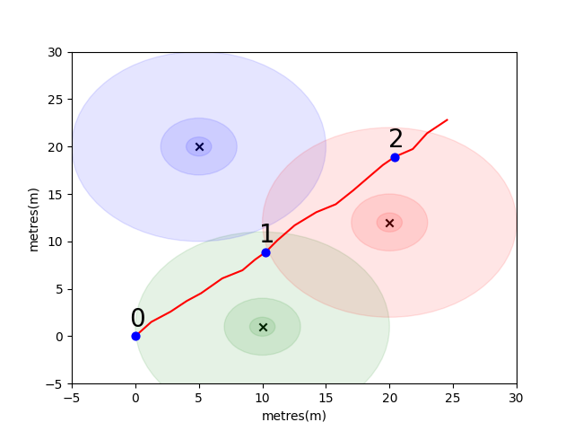
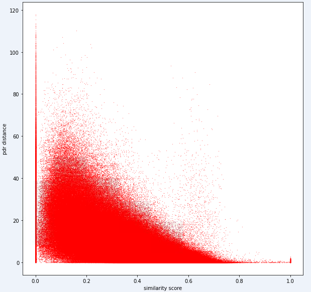
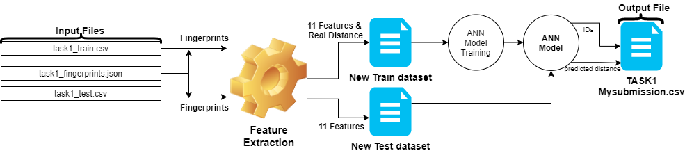
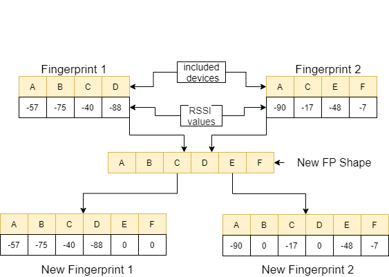
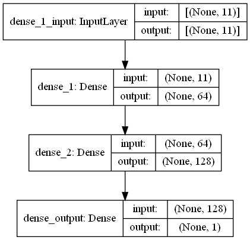
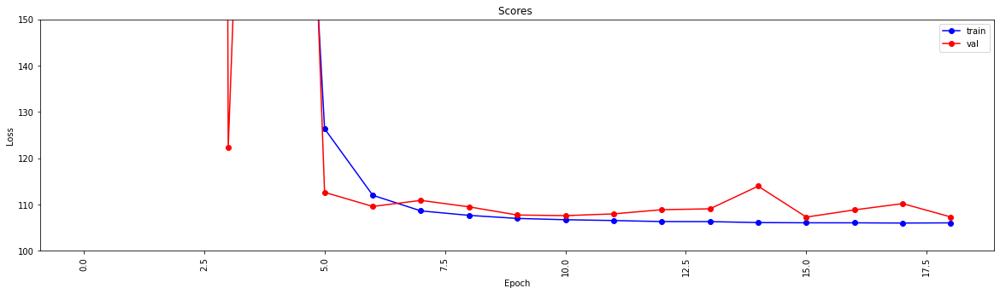
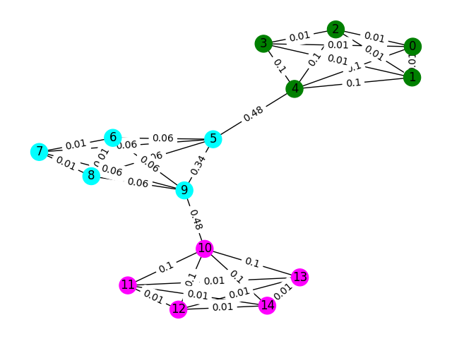
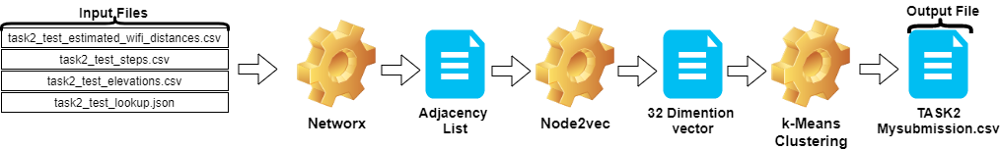
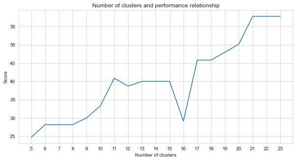

<center><h1>Huawei University Challenge Competition 2021</h1></center> 
<center><h1>Data Science for Indoor positioning</h1></center> 


## Our solution is the winner of the Huawei UK University Challenge Competition 2021.

- Members:
	- **Rabia Yasa Kostas**
	- **Kahraman Kostas**

The team presenter: **Kahraman Kostas**


### You can download the original versions of the questions given in the competition here: [ Task 1 ](https://drive.google.com/file/d/1UB8lISg13y6MdyEmQWR3iJ1kMbNrQLEP/view?usp=sharing) & [ Task 2 ](https://drive.google.com/file/d/194oSp15BkEBktx9kEmLP-qXg6YD0ZklO/view?usp=sharing)


<center> <h1>TASK 1 QUESTION</h1> </center> 


## 1.1 WiFi Similarity Introduction

To get you started we've put together a simple problem to introduce some key indoor positioning concepts. Consider the following environment: a user is travelling in open space in the presence of 3 WiFi emitters (we call the data created by this user a trajectory). Each emitter has a unique mac address. The user is equipped with a smartphone that will periodically scan the WiFi environment and record the RSSI of each detected mac (in dB).

For this model we have used a standard log-loss free-space propagation model for each of the emitters. This is a simplistic model that works well in free space, but breaks down in real indoor environments with walls and other obstacles which can bounce the signals around in a more complex manner. In general we do expect to see a steep drop in RSSI over distance as the fixed energy from the emitting antenna is spread over an increasing area as the wave propagates. In the diagram below each circle denotes a drop of 10dB.

The user walks North-East from point (0,0) and there phone makes three scans of the environment. The data recorded at each scan is shown below.
```
scan 0 -> {'green': -60, 'blue': -66, 'red': -67}
scan 1 -> {'green': -58, 'blue': -61, 'red': -60} 
scan 2 -> {'green': -66, 'blue': -62, 'red': -59}
```
The complex and locally unique properties of the WiFi environment make it very useful for indoor positioning systems. For example in the below image `scan 1` measures data at roughly the centroid of the three emitters and there is no other place in this environment where one could take a reading that would register similar RSSI values. Given a set of scans or "fingerprints" from independent trajectories, we are interested in calculating how similar they are in WiFi space as this is an indication of how close they are in real space.

Your first challenge is to write a function to calculate the *Euclidean Distance* and *Manhattan Distance* metrics between each of the scans in the sample trajectory that we introduced above. Using the data from a single trajectory is a good way to test the quality of a similarity metric as we can get fairly accurate estimates of the true distance using the data from the phone's intertial measurement unit (IMU) which is used by a pedestrian dead reckoning (PDR) module.





```python
def euclidean(fp1, fp2):   
    raise NotImplementedError

def manhattan(fp1, fp2):
    raise NotImplementedError
```
```python

# solution of the above functions
from scipy.spatial import distance
def euclidean(fp1, fp2):   
    fp1=list(fp1.values())
    fp2=list(fp2.values())
    return  distance.euclidean(fp1, fp2)

def manhattan(fp1, fp2):
    fp1=list(fp1.values())
    fp2=list(fp2.values())
    return  distance.cityblock(fp1, fp2)
```


```python
import json
import numpy as np
import matplotlib.pyplot as plt
from metrics import eval_dist_metric

with open("intro_trajectory_1.json") as f:
    traj = json.load(f)
    

## Pre-calculate the pair indexes we are interested in
keys = []
for fp1 in traj['fps']:
    for fp2 in traj['fps']:
         # only calculate the upper triangle
        if fp1['step_index'] > fp2['step_index']:
            keys.append((fp1['step_index'], fp2['step_index']))
 
## Get the distances from PDR
true_d = {}
for step1 in traj['steps']:
    for step2 in traj['steps']:
        key = (step1['step_index'],step2['step_index'])
        if key in keys:
            true_d[key] = abs(step1['di'] - step2['di'])
            
    
euc_d = {}
man_d = {}
for fp1 in traj['fps']:
    for fp2 in traj['fps']:
        key = (fp1['step_index'],fp2['step_index'])
        if key in keys:
            euc_d[key] = euclidean(fp1['profile'],fp2['profile'])
            man_d[key] = manhattan(fp1['profile'],fp2['profile'])

print("Euclidean Average Error")
print(f'{eval_dist_metric(euc_d, true_d):.2f}')

print("Manhattan Average Error")
print(f'{eval_dist_metric(man_d, true_d):.2f}')
```
```
Euclidean Average Error
9.29
Manhattan Average Error
4.90

```
If you correctly implemented the functions you should have seen that the average error for the euclidean metric was `9.29` whilst the Manhattan was only `4.90`. So for this data, the Manhattan distance is a better estimate of the true distance. 

This is of course a very simplistic model. Indeed, there is no direct relationship between the RSSI values and the free space distance in this way. Typically, when we create our own estimates for distance we would use the known pdr distances from within a trajectory to fit the numeric score to a physical distance estimate.

## 1.2 WiFi Similarity Metric

For your main challenge, we would like you to develop your own metric to estimate the real-world distance between two scans, based solely on their WiFi fingerprints. We will provide you with real crowdsourced data collected early in 2021 from a single mall. The data will contain 114661 fingerprints scans and 879824 distances between the scans. The distances will be our best estimate of the true distance given additional information that we will take into account. 

We will provide a test set of fingerprint pairs and you will need to write a function that tells us how far apart they are. 

This function could be as simple as a variation on one of the metrics that we introduced above or as complex as a full machine learning solution that learns to weight different mac addresses (or mac address combinations) differently in different situations.

Some final points to consider:
- lower RSSI values give less information.
- Open spaces will have different WiFi characteristics than tight spaces
- WiFi signals can be blocked by thick walls
- A small number of MACs may be from moving emitters (people running a Hot-Spot on their phone)


## 1.3 Loading the data

The data is assembled as three files for you.

The `task1_fingerprints.json` contains all the fingerprint information for the problem. That is each entry represents a real scan of the WiFi emitters in an area of the mall. You will find that the same MAC addresses will be present in many of the fingerprints.

The `task1_train.csv` contains the valid training pairs to help you design/train your algorithm. Each `id1-id2` pair has a labelled ground truth distance (in metres) and each id corresponds to a fingerprints from `task1_fingerprints.json`.

The `task1_test.csv` is the same format as `task1_train.csv` but doesn't have the displacements included. These are what we would like you to predict using the raw fingerprint information.


```python
import csv
import json
import os
from tqdm import tqdm

path_to_data = "for_contestants"

with open(os.path.join(path_to_data,"task1_fingerprints.json")) as f:
    fps = json.load(f)
    
with open(os.path.join(path_to_data,"task1_train.csv")) as f:
    train_data = []
    train_h = csv.DictReader(f)
    for pair in tqdm(train_h):
        train_data.append([pair['id1'],pair['id2'],float(pair['displacement'])])
        
with open(os.path.join(path_to_data,"task1_test.csv")) as f:
    test_h = csv.DictReader(f)
    test_ids = []
    for pair in tqdm(test_h):
        test_ids.append([pair['id1'],pair['id2']])
```

### 1.3.1 The Ideal Model

Ultimately, the ideal model should be able to find an exact mapping between the highly dimensional fingerprint space (1 fingerprint can contain many measurements) and the 1 dimensional distance space. It can be useful to plot the pdr distance (from the training data) against some computed similarity metric to see if the metric reveals an obvious trend. High similarity should correlate with low distance.

Below is one distance metric that we use internally for this task. You can see that even for this metric, we have a considerable amount of noise.

**Due to this level of noise, our scoring metric for task 1 will be biased towards precision over recall**



## 1.4 Submission

Your submission should use the **exact** ids from the *test1_test.csv* file and should populate the third (currently empty) displacement column with your estimated distance (in metres) for that fingerprint pair.


```python
def my_distance_function(fp1, fp2):
    raise NotImplementedError
```


```python
output_data = [["id1", "id2", "displacement"]]
for id1, id2 in tqdm(test_ids):
    fp1 = fps[id1]
    fp2 = fps[id2]
    
    distance_estimate = my_distance_function(fp1,fp2)
    output_data.append([id1,id2,distance_estimate])
    
with open("MySubmission.csv", "w", newline='') as f:
    writer = csv.writer(f)
    writer.writerows(output_data)
```


# ________________________________


<center> <h1>TASK 1 OUR SOLUTION</h1> </center> 

The steps in the first task can be summarized as follows.
- Input files are read, using those files :
    - Training data feature extraction is performed.
    - Testing data feature extraction is performed.
- At the end of feature extraction, two new dataset with 11 features is created (training data contains real distance, testing data does not).
- An artificial neural network (ANN) is created and trained with the Training data.
- Using the trained model, the test data is labelled and the submission file is created.

These steps are illustrated in the image below.



## 1.1 Installing modules
We used [Python 3.6.5](https://www.python.org/downloads/) to create the application file. We included some additional modules that were not included in the example file given at the start of the competition. These modules can be listed as:


| Molules | Task |
| ------ | ------ |
|[ tensorflow ](https://www.tensorflow.org/)| Deep Learning|
|[ Pandas  ](https://pandas.pydata.org/pandas-docs/stable/install.html)|  Data Analysis|
|[ SciPy ](https://scipy.org/) |Distance Computing|


We started with the installation of these modules as the first step.


```python
## 1.1 Installing modules
!pip install tensorflow==2.6.2
!pip install scipy
!pip install pandas
```

## 1.2  Setting Random Seeds
In this step, we fixed the related random seed to be used in order to obtain repeatable results. In this way, we have provided a deterministic path where we get the same result in every run. However, according to our observations, the results obtained with different computers may differ slightly (±1%)


```python
## 1.2  Setting Random Seeds
seed_value=0

import os
os.environ['PYTHONHASHSEED']=str(seed_value)

import random
random.seed(seed_value)

import numpy as np
np.random.seed(seed_value)

import tensorflow as tf
tf.random.set_seed(seed_value)

import tensorflow as tf

session_conf = tf.compat.v1.ConfigProto(intra_op_parallelism_threads=1, inter_op_parallelism_threads=1)
sess = tf.compat.v1.Session(graph=tf.compat.v1.get_default_graph(), config=session_conf)
```

## 1.3 Loading the data

In this section, we load the data that we will use. We took the code and explanations from the sample file given (`Task1-IPS-Challenge-2021.ipynb`).

The `task1_fingerprints.json` contains all the fingerprint information for the problem. That is each entry represents a real scan of the WiFi emitters in an area of the mall. You will find that the same MAC addresses will be present in many of the fingerprints.

The `task1_train.csv` contains the valid training pairs to help you design/train your algorithm. Each `id1-id2` pair has a labelled ground truth distance (in metres) and each id corresponds to a fingerprints from `task1_fingerprints.json`.

The `task1_test.csv` is the same format as `task1_train.csv` but doesn't have the displacements included. 


```python
## 1.3 Loading the data
import csv
import json
import os
from tqdm import tqdm

path_to_data = "for_contestants"

with open(os.path.join(path_to_data,"task1_fingerprints.json")) as f:
    fps = json.load(f)
    
with open(os.path.join(path_to_data,"task1_train.csv")) as f:
    train_data = []
    train_h = csv.DictReader(f)
    for pair in tqdm(train_h):
        train_data.append([pair['id1'],pair['id2'],float(pair['displacement'])])
        
with open(os.path.join(path_to_data,"task1_test.csv")) as f:
    test_h = csv.DictReader(f)
    test_ids = []
    for pair in tqdm(test_h):
        test_ids.append([pair['id1'],pair['id2']])
```

    879824it [05:16, 2778.31it/s]  
    5160445it [01:00, 85269.27it/s] 
    

## 1.4 Feature Extraction

In this step, we perform feature extraction using two functions. `feature_extraction_file` function simply pulls the relevant values of the fingerprints (in pairs) from the JSON file and sends them to the `feature_extraction`  function to do the calculations .


In the `feature_extraction` function, if these two fingerprints are different from each other in terms of size and the devices they contain, all the devices included in the two fingerprints are brought together to form a common sequence without repeating. In each array, we make these two arrays identical (in terms of devices they include) by assigning the value 0 to the non-corresponding devices. This process is explained with an example in the following image.



The distance between these two fingerprints, which are made similar, is calculated using 11 different methods\[1\]. These methods are:

- [Bray-Curtis distance](https://docs.scipy.org/doc/scipy/reference/generated/scipy.spatial.distance.braycurtis.html)
- [Canberra distance](https://docs.scipy.org/doc/scipy/reference/generated/scipy.spatial.distance.canberra.html)
- [Chebyshev distance](https://docs.scipy.org/doc/scipy/reference/generated/scipy.spatial.distance.chebyshev.html)
- [City Block (Manhattan) distance](https://docs.scipy.org/doc/scipy/reference/generated/scipy.spatial.distance.cityblock.html)
- [Correlation distance ](https://docs.scipy.org/doc/scipy/reference/generated/scipy.spatial.distance.correlation.html)
- [Cosine distance](https://docs.scipy.org/doc/scipy/reference/generated/scipy.spatial.distance.cosine.html)
- [Euclidean distance  ](https://docs.scipy.org/doc/scipy/reference/generated/scipy.spatial.distance.euclidean.html)
- [Jensen-Shannon distance ](https://docs.scipy.org/doc/scipy/reference/generated/scipy.spatial.distance.jensenshannon.html)
- [Minkowski distance](https://docs.scipy.org/doc/scipy/reference/generated/scipy.spatial.distance.minkowski.html)
- [Squared Euclidean distance](https://docs.scipy.org/doc/scipy/reference/generated/scipy.spatial.distance.sqeuclidean.html)
- [Weighted Minkowski distance ](https://docs.scipy.org/doc/scipy/reference/generated/scipy.spatial.distance.wminkowski.html)


Then, these values are directed to the `feature_extraction_file` function and saved as a CSV file within this function. In other words, fingerprints of various sizes turn into an 11-feature CSV file as a result of this process. The model to be used is trained and tested with these newly created features.


```python
## 1.4 Feature Extraction

def feature_extraction_file(data,name,flag):
    features = [["braycurtis",
    "canberra",
    "chebyshev",
    "cityblock",
    "correlation",
    "cosine",
    "euclidean",
    "jensenshannon",
    "minkowski",
    "sqeuclidean",
    "wminkowski", "real"]]
    for i in tqdm((data), position=0, leave=True):
        fp1 = fps[i[0]]
        fp2 = fps[i[1]]
        feature=feature_extraction(fp1,fp2) 
        if flag:
            feature.append(i[2])
        else:feature.append(0)
        features.append(feature)
    with open(name, "w", newline='') as f:
        writer = csv.writer(f)
        writer.writerows(features) 
    #print(features)
```


```python
## 1.4 Feature Extraction
def feature_extraction(fp1,fp2):
    mac=set(list(fp1.keys())+list(fp2.keys()))
    mac = { i : 0 for i in mac }
    f1=mac.copy()
    f2=mac.copy()
    for key in fp1:
        f1[key]=fp1[key]
    for key in fp2:
        f2[key]=fp2[key]        
    
    f1=list(f1.values())
    f2=list(f2.values())


    
    braycurtis=scipy.spatial.distance.braycurtis(f1,f2)
    canberra=scipy.spatial.distance.canberra(f1,f2)
    chebyshev=scipy.spatial.distance.chebyshev(f1,f2)
    cityblock=scipy.spatial.distance.cityblock(f1,f2)
    correlation=scipy.spatial.distance.correlation(f1,f2)
    cosine=scipy.spatial.distance.cosine(f1,f2)
    euclidean=scipy.spatial.distance.euclidean(f1,f2)
    jensenshannon=scipy.spatial.distance.jensenshannon(f1,f2)
    minkowski=scipy.spatial.distance.minkowski(f1,f2)
    sqeuclidean=scipy.spatial.distance.sqeuclidean(f1,f2)
    wminkowski=scipy.spatial.distance.wminkowski(f1,f2,1, np.ones(len(f1)))


    output_data=[braycurtis,
        canberra,
        chebyshev,
        cityblock,
        correlation,
        cosine,
        euclidean,
        jensenshannon,
        minkowski,
        sqeuclidean,
        wminkowski]
    output_data = [0 if x != x else x for x in output_data]
    return output_data
```

## 1.5 Model 
In this task, there is fingerprints scans which have RRSI signals from WiFi emitters surroundings in the mall. First challange wants us to estimate the distance between two fingerprints scans which is a regression task. We used ANN (Artificial Neural Networks) which is inspired by biological neural network. ANN consists of three layers; input layer, hidden layers (more than one) and output layer. ANN starts with input layer which includes the training data (with features), passes the data to the first hidden layer where the data is computed by the first hidden layer's weights. In hidden layers, there is an iteration of calculation of weights to the inputs and then apply them an activation function \[2\]. As our problem is regression, our last layer is a single output neuron: its output is the predicted the distances between pairs of fingerprint scans. Our first hidden layer has 64 and the second has 128 neurons. The all architecture of this model is shared as follows.



We perform  deep learning using two functions.The `create_model` function shapes the training data to train the model and determines the structure of the model. The  `model_features` function produces a model with the specified structure. The created model is saved to be used after being trained by the `create_model` function.


```python
## 1.5 Model 
import scipy.spatial
import pandas as pd
import numpy  as np
import matplotlib.pyplot as plt
from tensorflow import keras
from tensorflow.keras.models import Sequential
from tensorflow.keras.layers import Dense
#from keras.utils.vis_utils import plot_model
%matplotlib inline


def model_features(i,ii):
    model = Sequential()
    model.add(Dense(i, input_shape=(11, ), activation='relu', name='dense_1'))
    model.add(Dense(ii, activation='relu', name='dense_2'))
    model.add(Dense(1, activation='linear', name='dense_output'))
    model.compile(optimizer='adam', loss='mse', metrics=['mae'])
    model.summary()
    #plot_model(model, to_file='model_plot.png', show_shapes=True, show_layer_names=True)
    #print(model.get_config())
    return model

def create_model (name):     
    df = pd.read_csv(name)
    df.replace([np.inf, -np.inf], np.nan, inplace=True)
    df=df.fillna(0)
    X =df[df.columns[0:-1]]
    X_train=np.array(X)
    y_train=np.array(df[df.columns[-1]])

    model=model_features(64,128)
    history = model.fit(X_train, y_train, epochs=19, validation_split=0.5)#,batch_size=1)
    loss=history.history['loss']
    val_loss=history.history['val_loss']    


    my_xticks=list(range(len(loss)))
    plt.figure(figsize=(20,5))
    plt.plot(my_xticks,loss, linestyle='-', marker='o', color='b',label= "train")
    plt.plot(my_xticks,val_loss, linestyle='-', marker='o', color='r',label= "val")
    plt.title("Scores ")
    plt.legend(numpoints=1)
    plt.ylabel("Loss")
    plt.xlabel("Epoch")
    plt.xticks(rotation=90) 
    plt.ylim([100, 150]) 
    plt.show()
    madelname="./THEMODEL"
    model.save(madelname)
    print("Model Created!")
    

```

## 1.6 Checking the inputs

This function checks if the training and testing data have gone through feature extraction. If they have not, it creates these files and the model by calling the corresponding functions. After handling the model and all feature extraction, it formats the test data to produce the final results.


```python
## 1.6 Checking the inputs
from numpy import inf
from numpy import nan

def create_new_files(train,test):
    model_path="./THEMODEL/"
    my_train_file='new_train_features.csv'
    my_test_file='new_test_features.csv'
    
    
    
    if os.path.isfile(my_train_file) :
        pass  
    else:

        print("Please wait! Training data feature extraction is in progress...\nit will take about 10 minutes")
        feature_extraction_file(train,my_train_file,1)
        print("TThe training feature extraction completed!!!")       

        

    if os.path.isfile(my_test_file) :
        pass 
    else:

        print("Please wait! Testing data feature extraction is in progress...\nit will take about 100-120 minutes")
        feature_extraction_file(test,my_test_file,0)
        print("The testing feature extraction completed!!!")           
    

    if  os.path.isdir(model_path):
        pass  
    else:

        print("Please wait! Creating the deep learning model...\nit will take about 10 minutes")
        create_model(my_train_file)
        print("The model file created!!!\n\n\n")   
    
    model = keras.models.load_model(model_path)
    df = pd.read_csv(my_test_file)
    df.replace([np.inf, -np.inf], np.nan, inplace=True)
    df=df.fillna(0)
    X_train =df[df.columns[0:-1]]
    X_train=np.array(X_train)
    y_train=np.array(df[df.columns[-1]])
    predicted=model.predict(X_train)  
    print("Please wait! Creating resuşts... ")
      
    return predicted
```

## 1.7 Submission 
This step triggers feature extraction and model creation processes and allows all processes to begin. So, using the IDs from the `test1_test.csv` file it fills the third (displacement) column with the estimated distance for this fingerprint pairs and it saves this file in the directory with the name `TASK1-MySubmission.csv`. 


```python
## 1.7 Submission 
distance_estimate = create_new_files(train_data,test_ids)
count=0

output_data = [["id1", "id2", "displacement"]]
for id1, id2 in tqdm(test_ids):   
    output_data.append([id1,id2,distance_estimate[count][0]])
    count+=1
print("Process finished. Preparing result file ...")  
with open("TASK1-MySubmission.csv", "w", newline='') as f:
    writer = csv.writer(f)
    writer.writerows(output_data)
print("The results are ready.\n See MySubmission.csv")  
```

    Please wait! Creating the deep learning model...
    it will take about 10 minutes
    Model: "sequential_3"
    _________________________________________________________________
    Layer (type)                 Output Shape              Param #   
    =================================================================
    dense_1 (Dense)              (None, 64)                768       
    _________________________________________________________________
    dense_2 (Dense)              (None, 128)               8320      
    _________________________________________________________________
    dense_output (Dense)         (None, 1)                 129       
    =================================================================
    Total params: 9,217
    Trainable params: 9,217
    Non-trainable params: 0
    _________________________________________________________________
    Epoch 1/19
    13748/13748 [==============================] - 30s 2ms/step - loss: 2007233.6250 - mae: 161.3013 - val_loss: 218.8822 - val_mae: 11.5630
    Epoch 2/19
    13748/13748 [==============================] - 27s 2ms/step - loss: 24832.6309 - mae: 53.9385 - val_loss: 123437.0859 - val_mae: 307.2885
    Epoch 3/19
    13748/13748 [==============================] - 26s 2ms/step - loss: 4028.0859 - mae: 29.9960 - val_loss: 3329.2024 - val_mae: 49.9126
    Epoch 4/19
    13748/13748 [==============================] - 27s 2ms/step - loss: 904.7919 - mae: 17.6284 - val_loss: 122.3358 - val_mae: 6.8169
    Epoch 5/19
    13748/13748 [==============================] - 25s 2ms/step - loss: 315.7050 - mae: 11.9098 - val_loss: 404.0973 - val_mae: 15.2033
    Epoch 6/19
    13748/13748 [==============================] - 26s 2ms/step - loss: 126.3843 - mae: 7.8173 - val_loss: 112.6499 - val_mae: 7.6804
    Epoch 7/19
    13748/13748 [==============================] - 27s 2ms/step - loss: 112.0149 - mae: 7.4220 - val_loss: 109.5987 - val_mae: 7.1964
    Epoch 8/19
    13748/13748 [==============================] - 26s 2ms/step - loss: 108.6342 - mae: 7.3271 - val_loss: 110.9016 - val_mae: 7.6862
    Epoch 9/19
    13748/13748 [==============================] - 26s 2ms/step - loss: 107.6721 - mae: 7.2827 - val_loss: 109.5083 - val_mae: 7.5235
    Epoch 10/19
    13748/13748 [==============================] - 27s 2ms/step - loss: 107.0110 - mae: 7.2290 - val_loss: 107.7498 - val_mae: 7.1105
    Epoch 11/19
    13748/13748 [==============================] - 29s 2ms/step - loss: 106.7296 - mae: 7.2158 - val_loss: 107.6115 - val_mae: 7.1178
    Epoch 12/19
    13748/13748 [==============================] - 26s 2ms/step - loss: 106.5561 - mae: 7.2039 - val_loss: 107.9937 - val_mae: 6.9932
    Epoch 13/19
    13748/13748 [==============================] - 26s 2ms/step - loss: 106.3344 - mae: 7.1905 - val_loss: 108.8941 - val_mae: 7.4530
    Epoch 14/19
    13748/13748 [==============================] - 27s 2ms/step - loss: 106.3188 - mae: 7.1927 - val_loss: 109.0832 - val_mae: 7.5309
    Epoch 15/19
    13748/13748 [==============================] - 27s 2ms/step - loss: 106.1150 - mae: 7.1829 - val_loss: 113.9741 - val_mae: 7.9496
    Epoch 16/19
    13748/13748 [==============================] - 26s 2ms/step - loss: 106.0676 - mae: 7.1788 - val_loss: 107.2984 - val_mae: 7.2192
    Epoch 17/19
    13748/13748 [==============================] - 27s 2ms/step - loss: 106.0614 - mae: 7.1733 - val_loss: 108.8553 - val_mae: 7.4640
    Epoch 18/19
    13748/13748 [==============================] - 28s 2ms/step - loss: 106.0113 - mae: 7.1790 - val_loss: 110.2068 - val_mae: 7.6562
    Epoch 19/19
    13748/13748 [==============================] - 27s 2ms/step - loss: 106.0519 - mae: 7.1791 - val_loss: 107.3276 - val_mae: 7.0981
    





    INFO:tensorflow:Assets written to: ./THEMODEL\assets
    Model Created!
    The model file created!!!
    
    
    
    Please wait! Creating resuşts... 
    

    100%|████████████████████████████████████████████████████████████████████| 5160445/5160445 [00:08<00:00, 610910.29it/s]
    

    Process finished. Preparing result file ...
    The results are ready.
     See MySubmission.csv
    


# --------------------------
<center> <h1>TASK 2 QUESTION</h1> </center> 
## 2.1 Graph Clustering Introduction

Given that we now have a metric for evaluating WiFi distance our next task is to seperate trajectories from a mall (a different mall to that used in the first challenge!) into the seperate floors that they belong in. You can do this in different ways, but we would strongly suggest a graph clustering approach.

Consider each WiFi fingerprint in the data as a node in a graph and that we can form an edge with other fingerprints in the graph by evaluating the similarity any two fingerprints. We can assign a high weight to edges where we have a high similarity between fingerprints and a low weight (or no edge) between those that are not similar. In theory, a perfectly accurate similarity metric would trivially seperate floors as we could exclude all edges of greater than around 4 metres (roughly the height of 1 storey of a building). In reality it is likely that we will make false edges between floors and we will need to somehow break these edges.

Let's start with a simple example. Consider the graph below where the node colours show the true floor classification of the fingerprint and the edges reflect that we believe these nodes exist on the same floor. For this exercise we have pre-labelled each edge with its "Betweenness Score", a metric that counts how many times this edge is walked by taking the shortest path between any two nodes in the graph. Typically, this will reveal edges that indicate high connectivity and may be candidates for removal.

In this example, use the edge-betweenness score to detect the graph communties. Return a list of lists where each sublist contains the node ids of the communities. Note this is just to help your understanding of the problem and does not count for the actual solution.




```python
def detect_communities(Graph):
    ## This function should return a list of lists containing 
    ## the node ids of the communities that you have detected.

    eb_score = nx.edge_betweenness_centrality(G)
            
    raise NotImplementedError
```


```python
import networkx as nx
from metrics import check_result

G = nx.read_adjlist("graph.adjlist")

communities = detect_communities(G)

if check_result(communities):
    print("Correct!")
else:
    print("Try again")
```

## 2.2 Full Mall Graph Clustering

### Train

The sample training data for this problem is a set of 106981 fingerprints (`task2_train_fingerprints.json`) and some edges between them. We have provided files that indicate three different edge types, all of which should be treated differently. 

`task2_train_steps.csv` indicates edges that connect subsequent steps within a trajectory. These edges should be highly trusted as they indicate a certainty that two fingerprints were recorded from the same floor.

`task2_train_elevations.csv` indicate the opposite of the steps. These elevations indicate that the fingerprints are almost definitely from a different floor. You can thus extrapolate that if fingerprint $N$ from trajectory $n$ is on a different floor to fingerprint $M$ from trajectory $m$, then all other fingerprints in both trajectories $m$ and $n$ must also be on seperate floors.

`task2_train_estimated_wifi_distances.csv` are the pre-computed distances that we have calculated using our own distance metric. This metric is imperfect and as such we know that many of these edges will be incorrect (i.e. they will connect two floors together). We suggest that initially you use the edges in this file to construct your initial graph and compute some solution. However, if you get a high score on task1 then you might consider computing your own wifi distances to build a graph.

Your graph can be at one of two levels of detail, either trajectory level or fingerprint level, you can choose what representation you want to use, but ultimately we want to know the **trajectory clusters**. Trajectory level would have every node as a trajectory and edges between nodes would occur if fingerprints in their trajectories had high similiraty. Fingerprint level would have each fingerprint as a node. You can lookup the trajectory id of the fingerprint using the `task2_train_lookup.json` to convert between representations. 

To help you debug and train your solution we have provided a ground truth for some of the trajectories in `task2_train_GT.json`. In this file the keys are the trajectory ids (the same as in `task2_train_lookup.json`) and the values are the real floor id of the building.

### Test

The test set is the exact same format as the training set (for a seperate building, we weren't going to make it that easy ;) ) but we haven't included the equivalent ground truth file. This will be withheld to allow us to score your solution.

Points to consider
- When doing this on real data we do not know the exact number of floors to expect, so your model will need to decide this for itself as well. For this data, do not expect to find more than 20 floors or less than 3 floors.
- Sometimes in balcony areas the similarity between fingerprints on different floors can be deceivingly high. In these cases it may be wise to try to rely on the graph information rather than the individual similarity (e.g. what is the similarity of the other neighbour nodes to this candidate other-floor node?)
- To the best of our knowledge there are no outlier fingerprints in the data that do not belong to the building. Every fingerprint belongs to a floor


## 2.3 Loading the data

In this section we will provide some example code to open the files and construct both types of graph.


```python
import os
import json
import csv
import networkx as nx
from tqdm import tqdm

path_to_data = "task2_for_participants/train"

with open(os.path.join(path_to_data,"task2_train_estimated_wifi_distances.csv")) as f:
    wifi = []
    reader = csv.DictReader(f)
    for line in tqdm(reader):
        wifi.append([line['id1'],line['id2'],float(line['estimated_distance'])])
        
with open(os.path.join(path_to_data,"task2_train_elevations.csv")) as f:
    elevs = []
    reader = csv.DictReader(f)
    for line in tqdm(reader):
        elevs.append([line['id1'],line['id2']])        

with open(os.path.join(path_to_data,"task2_train_steps.csv")) as f:
    steps = []
    reader = csv.DictReader(f)
    for line in tqdm(reader):
        steps.append([line['id1'],line['id2'],float(line['displacement'])]) 
        
fp_lookup_path = os.path.join(path_to_data,"task2_train_lookup.json")
gt_path = os.path.join(path_to_data,"task2_train_GT.json")

with open(fp_lookup_path) as f:
    fp_lookup = json.load(f)

with open(gt_path) as f:
    gt = json.load(f)
   
```

### Fingerprint graph
This is one way to construct the fingerprint-level graph, where each node in the graph is a fingerprint. We have added edge weights that correspond to the estimated/true distances from the wifi and pdr edges respectively. We have also added elevation edges to indicate this relationship. You might want to explicitly enforce that there are *none* of these edges (or any valid elevation edge between trajectories) when developing your solution. 


```python
G = nx.Graph()

for id1,id2,dist in tqdm(steps):
    G.add_edge(id1, id2, ty = "s", weight=dist)
    
for id1,id2,dist in tqdm(wifi):
    G.add_edge(id1, id2, ty = "w", weight=dist)
    
for id1,id2 in tqdm(elevs):
    G.add_edge(id1, id2, ty = "e")
```

### Trajectory graph
The trajectory graph is arguably not as simple as you need to think of a way to represent many wifi connections between trajectories. In the example graph below we just take the mean distance as a weight, but is this really the best representation?


```python
B = nx.Graph()

# Get all the trajectory ids from the lookup
valid_nodes = set(fp_lookup.values())

for node in valid_nodes:
    B.add_node(node)

# Either add an edge or append the distance to the edge data
for id1,id2,dist in tqdm(wifi):
    if not B.has_edge(fp_lookup[str(id1)], fp_lookup[str(id2)]):
        
        B.add_edge(fp_lookup[str(id1)], 
                   fp_lookup[str(id2)], 
                   ty = "w", weight=[dist])
    else:
        B[fp_lookup[str(id1)]][fp_lookup[str(id2)]]['weight'].append(dist)
        
# Compute the mean edge weight
for edge in B.edges(data=True):
    B[edge[0]][edge[1]]['weight'] = sum(B[edge[0]][edge[1]]['weight'])/len(B[edge[0]][edge[1]]['weight'])
        
# If you have made a wifi connection between trajectories with an elev, delete the edge
for id1,id2 in tqdm(elevs):
    if B.has_edge(fp_lookup[str(id1)], fp_lookup[str(id2)]):
        B.remove_edge(fp_lookup[str(id1)], 
                      fp_lookup[str(id2)])
```

## 2.3 Submission
Your submission should be a csv file where trajectories that you believe to be on the same floor have their index on the same row seperated by commas. Each new cluster will be entered on a new row.

For example, see the below random entry. 


```python
import random

random_data = []
n_clusters = random.randint(50,100)
for i in range(0,n_clusters):
    random_data.append([])

for traj in set(fp_lookup.values()):
    cluster = random.randint(0,n_clusters-1)
    random_data[cluster].append(traj)
    
with open("MyRandomSubmission.csv", "w", newline='') as f:
    csv_writer = csv.writer(f)
    csv_writer.writerows(random_data)
```

<center> <h1>TASK 2 OUR SOLUTION</h1> </center> 

The steps in task 2 can be summarized as follows:

- The inputs are read and a graphic file is created from them.
- The graphic file is saved as an adjacency list.
- The adjacency list is vectorized using `Node2vec`.
- IDs are grouped by the k-means algorithm according to the vectors.
- The results file (`TASK2-Mysubmission.csv`) is prepared according to the trajectory of IDs .

These steps are illustrated in the image below.



## 2.1 Installing modules
We used [Python 3.6.5](https://www.python.org/downloads/) to create the application file. We included some additional modules that were not included in the example file given at the start of the competition. These modules can be listed as:


| Molules | Task |
| ------ | ------ |
|[ scikit-learn ](https://scikit-learn.org/stable/install.html)| Machine Learning & Data Preparation|
|[ node2vec  ](https://snap.stanford.edu/node2vec/)| Scalable Feature Learning for Networks|
|[ numpy ](https://numpy.org/) |Mathematical Operations|


We started with the installation of these modules as the first step.


```python
## 2.1 Installing modules
!pip install node2vec
!pip install scikit-learn
!pip install numpy 
```

## 2.2  Setting Random Seeds
In this step, we fixed the related random seed to be used in order to obtain repeatable results. In this way, we have provided a deterministic path where we get the same result in every run. However, according to our observations, the results obtained on different computers may differ slightly (±1%)


```python
## 2.2  Setting Random Seeds
seed_value=0
import os
os.environ['PYTHONHASHSEED']=str(seed_value)
import random
random.seed(seed_value)
import numpy as np
np.random.seed(seed_value)
```

## 2.3 Loading the data  
In this section, the files given for the test data are loaded.
- `wifi`  variable takes IDs and weights from the  `task2_test_estimated_wifi_distances.csv`.
- `steps`  variable takes IDs and weights from file `task2_test_steps.csv`.
- `elevs`  variable takes IDs from file  `task2_test_elevations.csv`.
- `fp_lookup`  variable gets  IDs and trajectories from the  `task2_test_lookup.json` file.


We did not prefer the method of recalculating the estimated distances given in wifi with the model we obtained in Task1, because the results we obtained from this process did not make a significant difference. That's why we didn't use the `task2_test_fingerprints.json` file in our ultimate work.


```python
## 2.3 Loading the data  
import os
import json
import csv
import networkx as nx
from tqdm import tqdm

path_to_data = "task2_for_participants/test"

with open(os.path.join(path_to_data,"task2_test_estimated_wifi_distances.csv")) as f:
    wifi = []
    reader = csv.DictReader(f)
    for line in tqdm(reader):
        wifi.append([line['id1'],line['id2'],float(line['estimated_distance'])])
        
with open(os.path.join(path_to_data,"task2_test_elevations.csv")) as f:
    elevs = []
    reader = csv.DictReader(f)
    for line in tqdm(reader):
        elevs.append([line['id1'],line['id2']])        

with open(os.path.join(path_to_data,"task2_test_steps.csv")) as f:
    steps = []
    reader = csv.DictReader(f)
    for line in tqdm(reader):
        steps.append([line['id1'],line['id2'],float(line['displacement'])]) 
        
fp_lookup_path = os.path.join(path_to_data,"task2_test_lookup.json")

with open(fp_lookup_path) as f:
    fp_lookup = json.load(f)
```

    3773297it [00:19, 191689.25it/s]
    2767it [00:00, 52461.27it/s]
    139537it [00:00, 180082.01it/s]
    

## 2.3 Generating the Trajectory  graph. 
We take the average distance as the weight when creating the Trajectory graph. We used the example given for Task 2 (`Task2-IPS-Challenge-2021.ipynb`) for this process. We saved the resulting graph (`B`) as an adjacency list in the directory (as `my.adjlist`).


```python
## 2.3 Generating the Trajectory  graph. 
B = nx.Graph()

# Get all the trajectory ids from the lookup
valid_nodes = set(fp_lookup.values())

for node in valid_nodes:
    B.add_node(node)

# Either add an edge or append the distance to the edge data
for id1,id2,dist in tqdm(wifi):
    if not B.has_edge(fp_lookup[str(id1)], fp_lookup[str(id2)]):
        
        B.add_edge(fp_lookup[str(id1)], 
                   fp_lookup[str(id2)], 
                   ty = "w", weight=[dist])
    else:
        B[fp_lookup[str(id1)]][fp_lookup[str(id2)]]['weight'].append(dist)
        
# Compute the mean edge weight
for edge in B.edges(data=True):
    B[edge[0]][edge[1]]['weight'] = sum(B[edge[0]][edge[1]]['weight'])/len(B[edge[0]][edge[1]]['weight'])
        
# If you have made a wifi connection between trajectories with an elev, delete the edge
for id1,id2 in tqdm(elevs):
    if B.has_edge(fp_lookup[str(id1)], fp_lookup[str(id2)]):
        B.remove_edge(fp_lookup[str(id1)], 
                      fp_lookup[str(id2)])

nx.write_adjlist(B, "my.adjlist")
```

    100%|████████████████████████████████████████████████████████████████████| 3773297/3773297 [00:27<00:00, 135453.95it/s]
    100%|██████████████████████████████████████████████████████████████████████████████████████| 2767/2767 [00:00<?, ?it/s]
    

## 2.4 Converting nodes to vectors
Before giving the adjacency list as input to the machine learning algorithms, we convert the nodes to vector. In our work we used Node2vec as a graph embedding algorithm methodology proposed by Grover&Leskovec in 2016 \[3\]. Node2vec is a semi-supervised algorithm for feature learning of the nodes in the network. Node2vec is created based on the skip-gram technique, which is an NLP approach motivated on Distributional Structure concept.According to idea, if different words used in similar contexts they probably have a similar meaning and there is an obvious relationship between them. Skip-gram technique uses center word(input) to predict neighbours(output) while computing the probabilities of surroundings based on a given window size (contiguous sequence of items before of after the center), in other words N-grams. Unlike the NLP approach, Node2vec system is not fed with words which have a linear structure, but nodes and edges, which have a distributed graphical structure. This multidimensional structure makes embeddings complex and computationally expensive, but Node2vec uses negative sampling with optimizing stochastic gradient descent (SGD) to deal with it. In addition to this, The random walk approach is used to detect sample neighboring nodes of the source node in a nonlinear structure. 

In our study, we first performed the vector representation of node relationships in low-dimensional space by modeling with node2vec from given distance of two nodes (weights). Then we used the output of Node2vec (graph embeddings), which has vectors of nodes, to feed traditional K-means clustering algorithm.

The parameters we use in Nod2vec can be listed as follows:

| Hyperparameter | Value |
| ------ | ------ |
|dimensions|32|
|walk_length|15|
|num_walks|100|
|workers|1|
|seed|0|
|window|10|
|min_count|1|
|batch_words|4|

The Node2vec model takes the adjacency list as input and outputs a 32-size vector. In this part, the node.py file is created and run in the `Jupyter Notebook`. There are two reasons why it is preferable to run externally rather than in a Jupyter notebook cell.
- It allows fixing the random seed of the node2vec module. Thus, it ensures repeatability by providing the same result in different runs.
- `Node2vec` is a very computationally expensive method, RAM overflow error is quite possible if run inside Jupyter notebook. Creating and running `Node2vec` model outside avoids this error.

The cell below creates the file named node.py. This file creates the node2vec model. This model takes the the adjacency list (`my.adjlist`) as input and creates a 32-dimensional vector file as output (`vectors.emb`).

**Important! The code below should be run in Linux distributions (Tested in Google colab and Ubuntu).**


```python
# 2.4 Converting nodes to vectors
# A folder named tmp is created. This folder is essential for the node2vec model to use less RAM.
try:
    if not os.path.exists("tmp"):
        os.makedirs("tmp")
except OSError:
    print ("The folder could not be created!\n Please manually create the \"tmp\" folder in the directory")


node="""

# importing related modules

from node2vec import Node2Vec
import networkx as nx

#importing  adjacency list file as B
B = nx.read_adjlist("my.adjlist")

seed_value=0


# Specifying the input and hyperparameters of the node2vec model
node2vec = Node2Vec(B, dimensions=32, walk_length=15, num_walks=100, workers=1,seed=seed_value,temp_folder = './tmp')  

#Assigning/specifying random seeds

import os
os.environ['PYTHONHASHSEED']=str(seed_value)

import random
random.seed(seed_value)

import numpy as np
np.random.seed(seed_value)


# creation of the model

model = node2vec.fit(window=10, min_count=1, batch_words=4,seed=seed_value)   


# saving the output vector

model.wv.save_word2vec_format("vectors.emb")

# save the model
model.save("vectorMODEL")

"""
f = open("node.py", "w")
f.write(node)
f.close()


!PYTHONHASHSEED=0 python3 node.py 

```

## 2.4 Reshaping data
After our vector file is created, we read this file (`vectors.emb`). This file consists of 33 columns. The first column is the node number (IDs), and remain are vector values. By sorting the entire file by the first column, we return the nodes to their original order. Then we delete this ID column, which we will no longer use. So, we give the final shape of our data. Our data is ready to be used in machine learning applications.


```python
# 2.4 Reshaping data
vec = np.loadtxt("vectors.emb", skiprows=1)
print("shape of vector file: ",vec.shape)
print(vec)
vec=vec[vec[:,0].argsort()]; 
vec=vec[0:vec.shape[0],1:vec.shape[1]]
```

    shape of vector file:  (11162, 33)
    [[ 9.1200000e+03  3.9031842e-01 -4.7147268e-01 ... -5.7490986e-02
       1.3059708e-01 -5.4280665e-02]
     [ 6.5320000e+03 -3.5591956e-02 -9.8558587e-01 ... -2.7217887e-02
       5.6435770e-01 -5.7787680e-01]
     [ 5.6580000e+03  3.5879680e-01 -4.7564098e-01 ... -9.7607370e-02
       1.5506668e-01  1.1333219e-01]
     ...
     [ 2.7950000e+03  1.1724627e-02  1.0272172e-02 ... -4.5596390e-04
      -1.1507459e-02 -7.6738600e-04]
     [ 4.3380000e+03  1.2865483e-02  1.2103912e-02 ...  1.6619096e-03
       1.3672550e-02  1.4605848e-02]
     [ 1.1770000e+03 -1.3707868e-03  1.5238028e-02 ... -5.9994194e-04
      -1.2986251e-02  1.3706315e-03]]
    

## 2.5 Determine the number of clusters

Task-2 is a clustering problem. The premise that we need to decide when solving this problem is how many clusters we should divide into. For this, we tried different cluster numbers and compared the scores we got. The graph below shows the comparison of the number of clusters and the score obtained. As can be seen from this graph, the number of clusters increased continuously between 5 and 21, with some exception fluctuations, and stabilized after 21. For this reason, we focused on the number of clusters between 21 and 23 in our study.


```python
# 2.5 Determine the number of clusters
import numpy as np
import matplotlib.pyplot as plt
import seaborn as sns
import matplotlib
%matplotlib inline
sns.set_style("whitegrid")
agglom=[24.69,28.14,28.14,28.14,30,33.33,40.88,38.70,40,40,40,29.12,45.85,45.85,48.00,50.17,57.83,57.83,57.83]
plt.figure(figsize=(10,5))
plt.plot(range(5, 24), agglom)
matplotlib.pyplot.xticks(range(5, 24))
plt.title('Number of clusters and performance relationship')
plt.xlabel('Number of clusters')
plt.ylabel('Score')
plt.show()
```





## 2.5  Best result

Among the unsupervised machine learning methods we tried (such as [K-means](https://scikit-learn.org/stable/modules/clustering.html#k-means),
[Agglomerative Clustering](https://scikit-learn.org/stable/modules/clustering.html#hierarchical-clustering),
[Affinity Propagation](https://scikit-learn.org/stable/modules/clustering.html#affinity-propagation),
[Mean Shift](https://scikit-learn.org/stable/modules/clustering.html#mean-shift),
[Spectral clustering](https://scikit-learn.org/stable/modules/clustering.html#spectral-clustering),
[DBSCAN](https://scikit-learn.org/stable/modules/clustering.html#dbscan),
[OPTICS](https://scikit-learn.org/stable/modules/clustering.html#optics),
[BIRCH](https://scikit-learn.org/stable/modules/clustering.html#birch),
[Mini-Batch K-Means](https://scikit-learn.org/stable/modules/clustering.html#mini-batch-k-means)), we achieved the best results using k-Means with 23 clusters.


K-means is a clustering algorithm is one of the basic and traditional unsupervised machine learning techniques which make assumptions to find homogeneous or natural groups of elements (clusters) using unlabelled data. Clusters are to set of points (nodes in our data) grouped together which share particular similarities. K-means needs the target number of centroids which refers to how many groups the data should be divided into. Algorithm starts with group of randomly assigned centroids then continue iterations to find the best positions of them. The algorithm assigns the points/nodes to the appointed centroids using in-cluster the sum of squares of the member of points, this is continue updating and relocating\[4\]. In our example the number of centroids reflects the number of floors. It should be noted that this does not provide information about the order of the floors.


Below, k-Means application has been made for 23 clusters.


```python
# 2.5  Best result
from sklearn import cluster
import time

ML_results = []
k_clusters = 23
algorithms = {}
algorithms['KMeans'] =cluster.KMeans(n_clusters=k_clusters,random_state=10)
second=time.time()
for model in algorithms.values():
    model.fit(vec)
    ML_results=list(model.labels_)
    print(model,time.time()-second)
```

    KMeans(n_clusters=23, random_state=10) 1.082334280014038
    

## 2.6 Submission 
The output of the machine learning algorithm determines which cluster the fingerprints belong to. But what is required of us is to cluster the trajectories. Therefore, these fingerprints are converted to their trajectory counterparts using the `fp_lookup` variable. This output is processed into the `TASK2-Mysubmission.csv` file.


```python
## 2.6 Submission 
result={}
for ii,i in enumerate(set(fp_lookup.values())):
    result[i]=ML_results[ii]
        
    
ters={}
for i in result:
    if result[i] not in ters:
        ters[result[i]]=[]
        ters[result[i]].append(i)
    else:
        ters[result[i]].append(i)
        
        
        
final_results=[]
for i in ters:
    final_results.append(ters[i])
    
    
name="TASK2-Mysubmission.csv"    
with open(name, "w", newline='') as f:
    csv_writer = csv.writer(f)
    csv_writer.writerows(final_results)
print(name, "file is ready!")
```

    TASK2-Mysubmission.csv file is ready!
    

-----------------------

# References

\[1\] P. Virtanen  and SciPy 1.0 Contributors. SciPy 1.0: Fundamental Algorithms for Scientific Computing in Python. Nature Methods, 17:261--272, 2020.

\[2\] A. Geron, Hands-On Machine Learning with Scikit-Learn, Keras, and TensorFlow: Concepts, Tools, and Techniques to Build Intelligent Systems. O’Reilly Media, 2019

\[3\] A. Grover, J. Leskovec. ACM SIGKDD International Conference on Knowledge Discovery and Data Mining (KDD), 2016.

\[4\] Jin X., Han J. (2011) K-Means Clustering. In: Sammut C., Webb G.I. (eds) Encyclopedia of Machine Learning. Springer, Boston, MA. https://doi.org/10.1007/978-0-387-30164-8_425
